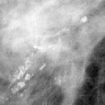
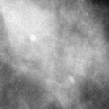

# MedicalCNN

||[](https://jupyter.org/try)

[](https://opensource.org/licenses/MIT)
[](https://zenodo.org/badge/latestdoi/251420622)


This project aims to perform **abnormality classification** in mammography by means of **Convolutional Neural Networks**. The dataset of interest is the **CBIS DDSM** dataset. The mammogram images feature two kinds of breast abnormalities: mass and calcification, which can be either benign or malignant.  
The classification task consists in distinguishing between the four cases:

- Benign mass
- Malignant mass
- Benign calcification
- Malignant calcification

A subtask is to just distinguish masses from calcifications.

The full detailed report is available [**here**](https://github.com/leoll2/MedicalCNN/blob/master/report.pdf).

   

*Left: example of mass*
*Right: example of calcification*

---

## Repo structure

All the Jupyter notebooks used for the experiments are collected in the `scripts` folder.

Specifically:

- [Scratch_CNN_2_class](https://github.com/leoll2/MedicalCNN/blob/master/scripts/Scratch_CNN_2_class.ipynb): CNN built from scratch for the 2-categories classification task.
- [Scratch_CNN_4_class](https://github.com/leoll2/MedicalCNN/blob/master/scripts/Scratch_CNN_4_class.ipynb): CNN built from scratch for the 4-categories classification task.
- [Scratch_CNN_ben_mal](https://github.com/leoll2/MedicalCNN/blob/master/scripts/Scratch_CNN_ben_mal.ipynb): CNN build from scratch for benign-malignant classification.
- [VGG16_2_class](https://github.com/leoll2/MedicalCNN/blob/master/scripts/VGG16_2_class.ipynb): VGG16 with feature-extraction and fine-tuning for the 2-categories classification task.
- [VGG16_4_class](https://github.com/leoll2/MedicalCNN/blob/master/scripts/VGG16_4_class.ipynb): VGG16 with feature-extraction and fine-tuning for the 4-categories classification task.
- [Baseline_Dual_CNN](https://github.com/leoll2/MedicalCNN/blob/master/scripts/Baseline_Dual_CNN.ipynb): Dual CNN model exploiting images of nearby healthy tissue too.
- [Composite_4_class](https://github.com/leoll2/MedicalCNN/blob/master/scripts/Composite_4_class.ipynb): Two parallel CNN models to decompose the 4-categories classification task.
- [Baseline_Siamese](https://github.com/leoll2/MedicalCNN/blob/master/scripts/Baseline_Siamese.ipynb): Siamese CNN exploiting images of nearby healthy tissue too.
- [Ensemble_2_class](https://github.com/leoll2/MedicalCNN/blob/master/scripts/Ensemble_2_class.ipynb): Ensemble of different CNN models for the 2-categories classification task.
- [Ensemble_4_class](https://github.com/leoll2/MedicalCNN/blob/master/scripts/Ensemble_2_class.ipynb): Ensemble of different CNN models for the 4-categories classification task.

Extra: 

- [LearningRate](https://github.com/leoll2/MedicalCNN/blob/master/scripts/LearningRate.ipynb): Experiments tuning the learning rate for different optimizers.

You can download the dataset from [Google Drive](https://drive.google.com/open?id=1bCzrSgELJPP2Me7wIvWX-ck9OAdHDUp6). All the scripts assume that the dataset zip file is located in the root of your Google Drive folder, but you can easily change it.

---

## Experiments and results

I developed and tested many models for the 2-class and 4-class tasks.

The best model for the 2-class task obtained a 91.37% accuracy on the test set.
The best model for the 4-class task obtained a 61.01% accuracy on the test set.

Comparing the results with those presented in many papers, the models achieved state-of-the-art accuracy [1][2][3].

```
[1] Neeraj Dhungel, Gustavo Carneiro, and Andrew P Bradley. “Automated mass
detection in mammograms using cascaded deep learning and random forests”.
In: 2015 international conference on digital image computing
[2] Dina A Ragab et al. “Breast cancer detection using deep convolutional neural
networks and support vector machines”. In: PeerJ 7 (2019)   
[3] Li Shen et al. “Deep learning to improve breast cancer detection on screening
mammography”. In: Scientific reports 9.1 (2019)  
```

See the report for full details.

---

## Tools

The project was developed using the following technologies:
- **Python**: scripting language
- **Keras**: open-source library for experimentation with deep neural networks
- **Google Colab**: free cloud-based Jupyter notebook environment by Google

---

## About the dataset

The dataset of interest is the **CBIS DDSM** *(Curated Breast Imaging Subset of Digital Database for Screening Mammography)*, a collection of mammography images by Lee et al. It is an updated version of the original DDSM dataset, where all the images have been segmented and labeled.
```
Rebecca Sawyer Lee, Francisco Gimenez, Assaf Hoogi , Daniel Rubin  (2016). Curated Breast Imaging Subset of DDSM [Dataset]. The Cancer Imaging Archive. DOI: 10.7937/K9/TCIA.2016.7O02S9CY
```

---

## Credits

The author (Leonardo Lai) designed and performed all the experiments listed in the project. 

If you want to cite this work, please use the following:
```
@software{leonardo_lai_2021_4700130,
  author       = {Leonardo Lai},
  title        = {leoll2/MedicalCNN: v1.0},
  month        = apr,
  year         = 2021,
  publisher    = {Zenodo},
  version      = {1.0},
  doi          = {10.5281/zenodo.4700130},
  url          = {https://doi.org/10.5281/zenodo.4700130}
}
```
